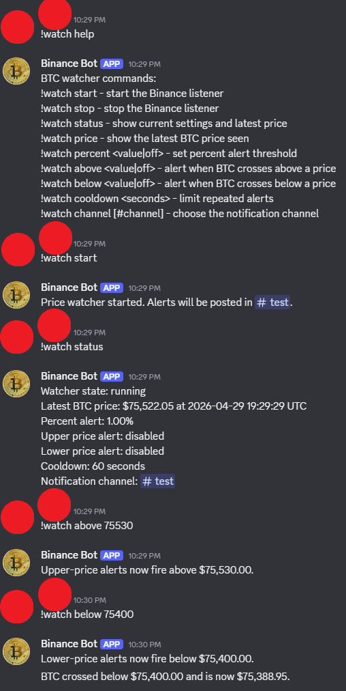
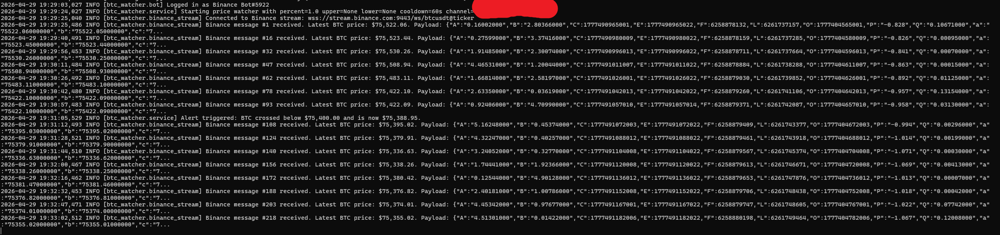

# BigDataAssingment2

Simple Python project for tracking the BTC price from Binance and sending Discord alerts. The bot can start and stop the watcher, change alert settings, and post a message when BTC moves by a chosen percentage or crosses a price level.

## Project Structure

```text
btc_watcher/
  alert_engine.py
  binance_stream.py
  bot.py
  config.py
  main.py
  models.py
  service.py
  settings_store.py
data/
  settings.json
images/
  example.png
  logs.png
requirements.txt
README.md
```

## Commands

The default command prefix is `!`, so the commands look like this:

- `!watch start`
- `!watch stop`
- `!watch status`
- `!watch price`
- `!watch percent 1.5`
- `!watch percent off`
- `!watch above 70000`
- `!watch above off`
- `!watch below 65000`
- `!watch below off`
- `!watch cooldown 120`
- `!watch channel`
- `!watch channel #alerts`

When you run `!watch start`, the bot uses the current channel for notifications if no channel has been set before.

## Settings

Use `.env.example` as a template and set the variables in your shell or Docker command.

- `DISCORD_TOKEN`: Discord bot token. Required to run the bot.
- `DISCORD_COMMAND_PREFIX`: Prefix used for commands. Default: `!`
- `BINANCE_STREAM_URL`: Binance WebSocket URL. Default: `wss://stream.binance.com:9443/ws/btcusdt@ticker`
- `DEFAULT_PERCENT_THRESHOLD`: Default percentage change threshold. Default: `1.0`
- `DEFAULT_UPPER_PRICE`: Optional default alert price for upward crossing
- `DEFAULT_LOWER_PRICE`: Optional default alert price for downward crossing
- `DEFAULT_COOLDOWN_SECONDS`: Minimum seconds between repeated notifications for the same alert type. Default: `60`
- `DISCORD_NOTIFICATION_CHANNEL_ID`: Optional channel id for alert delivery
- `AUTO_START_ON_READY`: Start the Binance listener when the bot connects. Default: `false`
- `SETTINGS_FILE`: Path used to persist runtime settings. Default: `data/settings.json`

## Discord Bot Setup

1. Open the Discord Developer Portal: https://discord.com/developers/applications
2. Create a new application and open the `Bot` page.
3. Create the bot user and copy the bot token.
4. In `Bot`, enable `Message Content Intent` because this project uses prefix commands like `!watch start`.
5. In `Installation`, enable `Guild Install`.
6. In `Guild Install` scopes, select `bot` and `applications.commands`.
7. Give the bot at least these permissions: `View Channels`, `Send Messages`, `Read Message History`.
8. Use the generated install link to add the bot to your Discord server.

## Launching The Program

### Run With Docker

Pull the published image from Docker Hub:

```bash
docker pull domvil/btc-discord-watcher:latest
```

Start the container with the required token:

```bash
docker run --rm \
  --name btc-discord-watcher \
  -e DISCORD_TOKEN=your-discord-bot-token \
  -e DISCORD_COMMAND_PREFIX=! \
  -e DEFAULT_PERCENT_THRESHOLD=1.0 \
  -e DEFAULT_COOLDOWN_SECONDS=60 \
  domvil/btc-discord-watcher:latest
```

You can add the other variables from `.env.example` to the `docker run` command if you want to override the defaults.

## Screenshots

### Discord Bot Commands And Alerts

Example interaction showing the help output, watcher startup, status checks, and threshold alerts.



### Runtime Logs

Sample console output showing the Binance ticker stream and alert activity.



## Docker Process Report

### Steps Followed:

1. Created a simple Python project: a Discord bot that watches the Binance BTC price stream and sends alerts.
2. Listed the Python dependencies in `requirements.txt` so they can be installed inside the container.
3. Added a `.dockerignore` file to exclude cache files, virtual environments, Git metadata, and local runtime data from the build context.
4. Wrote the Dockerfile shown below.
5. Built the Docker image with `docker build -t btc-discord-watcher:latest .`.
6. Ran the image with environment variables, mainly `DISCORD_TOKEN`, to start the bot inside the container.
7. Prepared the image to be tagged and pushed to Docker Hub.

### Dockerfile Contents

```dockerfile
FROM python:3.11-slim

ENV PYTHONDONTWRITEBYTECODE=1 \
    PYTHONUNBUFFERED=1

WORKDIR /app

COPY requirements.txt .
RUN pip install --no-cache-dir -r requirements.txt

COPY btc_watcher ./btc_watcher

CMD ["python", "-m", "btc_watcher.main"]
```

Line-by-line explanation:

- `FROM python:3.11-slim` uses a lightweight Python 3.11 base image for the container.
- `ENV PYTHONDONTWRITEBYTECODE=1` prevents Python from creating `.pyc` cache files inside the container.
- `PYTHONUNBUFFERED=1` makes Python print logs immediately, which is useful when viewing container output.
- `WORKDIR /app` sets `/app` as the working directory inside the container.
- `COPY requirements.txt .` copies the dependency list into the container.
- `RUN pip install --no-cache-dir -r requirements.txt` installs the required Python packages without keeping pip cache files.
- `COPY btc_watcher ./btc_watcher` copies the project source code into the container.
- `CMD ["python", "-m", "btc_watcher.main"]` starts the application when the container runs.

### Commands Used

Build the image:

```bash
docker build -t btc-discord-watcher:latest .
```

Run the full application:

```bash
docker run --rm \
  --name btc-discord-watcher \
  -e DISCORD_TOKEN=your-token \
  -e DISCORD_COMMAND_PREFIX=! \
  -e DEFAULT_PERCENT_THRESHOLD=1.0 \
  -e DEFAULT_COOLDOWN_SECONDS=60 \
  btc-discord-watcher:latest
```

Tag and push the image:

```bash
docker tag btc-discord-watcher:latest domvil/btc-discord-watcher:latest
docker push domvil/btc-discord-watcher:latest
```


